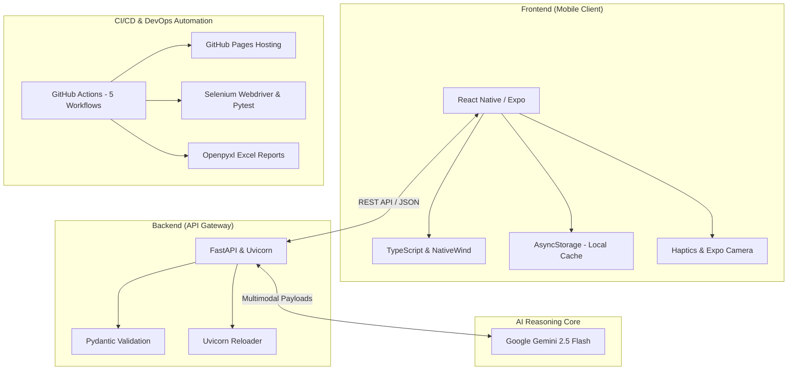
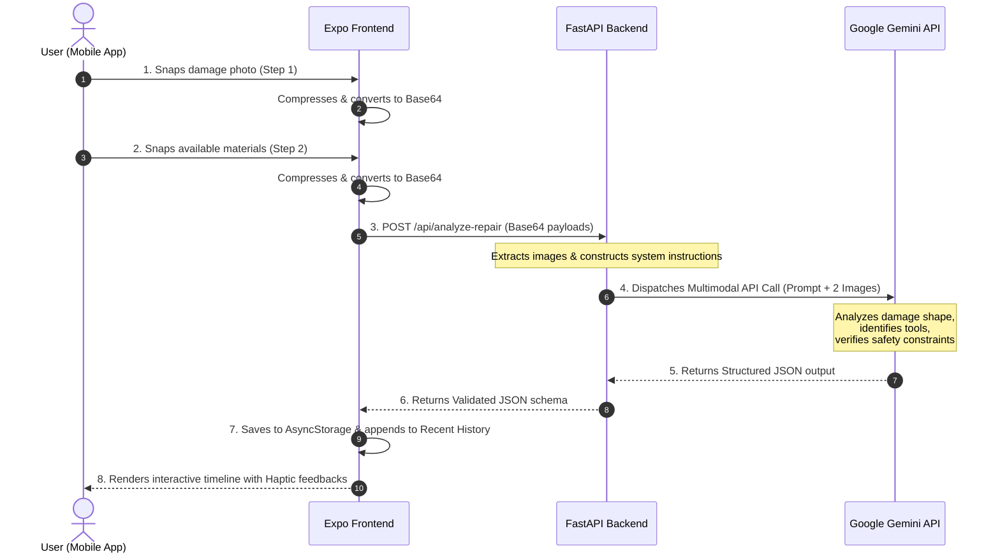
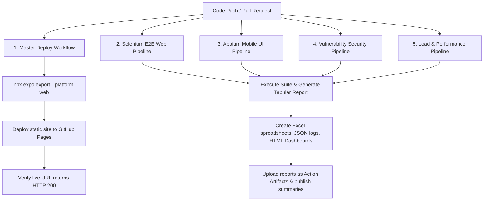

# SnapSolve System Architecture & Presentation Flow Guide

SnapSolve is an AI-powered, mobile-first frugal engineering application. It allows users to snap photos of mechanical damage and their available household materials, then uses multimodal Large Language Models to generate a customized, step-by-step repair guide.

---

## 🛠️ The Technology Stack

- **Frontend**: **React Native / Expo (TypeScript)**. Customized styling using **Tailwind CSS (NativeWind)**, haptic feedback integration, local file caching using **AsyncStorage**, and **Expo Camera** for image input.
- **Backend**: **FastAPI (Python)**. A lightweight, high-performance web gateway running on **Uvicorn** with custom CORS middleware and **Pydantic** schema models.
- **AI Core**: **Google Gemini 2.5 Flash / Lite**. A multimodal model that processes text and images simultaneously to perform logical reasoning under constraints.
- **DevOps**: **GitHub Actions**. Automatically orchestrates Expo web compilation, static site deployment to **GitHub Pages**, and runs 4 testing suites (Selenium, Appium, Vulnerability, Load) with custom Excel reporting on every push.

---

## 🔄 End-to-End Data & Execution Flow

Below is the execution flow from the moment the user opens the camera to the rendering of the interactive checklist:

### Flow Breakdown for Presentation:
1. **Multimodal Capture**: The user snaps a photo of the damaged object (e.g. cracked chair joint) and a photo of available materials (e.g. glue, tape, rope).
2. **On-Device Optimization**: Images are resized on-device to `800x800` at `70% JPEG quality` using **expo-image-manipulator** to compress file footprint (~50-200KB) and minimize network latency.
3. **API Dispatch**: base64 strings are posted to the FastAPI backend endpoint `/api/analyze-repair`.
4. **Structured Multimodal Reasoning**: The backend sends both images to the **Google Gemini API** alongside structured system prompts.
5. **JSON Schema Enforcement**: Gemini operates under a strict system instruction prompt to identify:
   - Bounding boxes of damage.
   - Matched items from the materials photo.
   - Structural safety warnings.
   - Chronological instructions.
6. **Execution Timeline & Caching**: The mobile client caches results in **AsyncStorage** (enabling offline reloading) and renders an interactive checkbox timeline. Each checked step triggers **haptic feedback** (tactile confirmation) and builds towards a full completion celebration banner.

---

## 🛡️ CI/CD Quality Gate & Testing Flow

For industrial-grade reliability, the repository runs a **GitHub Actions matrix** with **5 distinct workflows** operating in parallel on every code commit:

1. **Deployment & Verification**: The master workflow compiles the Expo web platform (`npx expo export --platform web`) and deploys to **GitHub Pages**. It runs a script to check that CSS/JS bundles load and returns a successful `HTTP 200`.
2. **Selenium E2E suite**: Runs **420 unique test cases** against the live deployed URL checking UI inputs, login, forms, CRUD, error boundaries, a11y, and viewport responsive layouts.
3. **Appium Mobile suite**: Runs **300 unique test cases** validating gestures, hardware permission prompts, orientation, and AsyncStorage.
4. **Vulnerability scan**: Runs **300 unique test cases** reviewing security posture against the OWASP Top 10 (SQL injection, broken auth, cross-site scripting).
5. **Load suite**: Runs **300 unique test cases** checking backend performance concurrency (500 to 2000 virtual users) and API response stress limits.
6. **Unified Artifact Management**: Excel spreadsheets (`Automation_Test_Report.xlsx`), interactive HTML dashboards, and Markdown summaries are generated, stored for 30 days, and posted directly to the pull request summary.

---

## 💡 Key Talking Points for Judges (How to Impress)

When presenting, highlight these **four architectural decisions** to show engineering depth:

1. **Multimodal Co-dependency (Frugal Innovation)**:
   > *"Unlike basic repair apps that just search standard guides, SnapSolve links the damage photo directly with the user's available materials photo. The AI constraints its output to instruct the user to fix the object using only what they have in front of them—no shopping required."*

2. **On-Device Bandwidth Compression**:
   > *"We optimized the app for low-bandwidth cellular environments (e.g. remote workshops) by resizing and compressing images on the mobile client before dispatching, reducing data consumption by up to 95%."*

3. **Strict JSON Output Contracts**:
   > *"We enforced strict JSON schema contracts on LLM outputs using structured prompt instructions. This prevents hallucinated formatting and ensures the client parser never encounters rendering crashes."*

4. **Tactile Micro-Animations (Premium UX)**:
   > *"We focused heavily on premium micro-interactions. The app features entrance animations, breathing camera triggers, haptic confirmation feedback when checking off steps, and interactive physics completion banners."*
